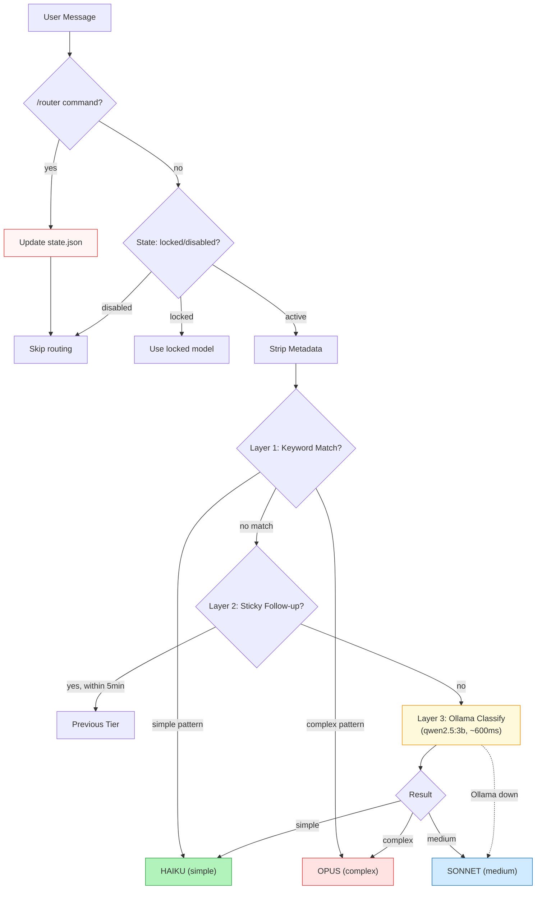

# OpenClaw Smart Router

Intelligent 3-tier model routing for OpenClaw, based on the **20-Watt Principle**: Your brain uses 20 watts. Not every thought needs full power.

**Save 65-78% on inference costs** by automatically routing:
- **Simple requests** (greetings, confirmations) → Claude Haiku (5x cheaper)
- **Medium tasks** (code, file ops, analysis) → Claude Sonnet (default)
- **Complex work** (strategy, architecture, vision) → Claude Opus

## Features

- ✅ **Local classification** — Uses Ollama (no API calls for routing decisions)
- ✅ **Sticky follow-ups** — Short replies stay in the same tier (don't downgrade Opus to Haiku for "ok mach das")
- ✅ **Metadata-aware** — Strips OpenClaw internal metadata before classifying
- ✅ **Fail-safe** — If Ollama is down, defaults to Sonnet (medium tier)
- ✅ **Manual controls** — `/router lock opus`, `/router off`, `/router on` for override
- ✅ **Fully configurable** — Choose your own models, providers, timeouts

## Installation

```bash
openclaw plugins install @macstenk/openclaw-smart-router
```

Then restart your gateway:

```bash
openclaw gateway restart
```

## Configuration

Add to `~/.openclaw/config.json`:

```json
{
  "plugins": {
    "entries": {
      "smart-router": {
        "enabled": true,
        "config": {
          "ollamaBase": "http://localhost:11434",
          "classifyModel": "qwen2.5:3b",
          "simpleModel": "claude-haiku-4-5",
          "simpleProvider": "anthropic",
          "complexModel": "claude-opus-4-6",
          "complexProvider": "anthropic",
          "stickyDecayMinutes": 5,
          "timeoutMs": 3000,
          "logRouting": true
        }
      }
    }
  }
}
```

### Config Options

| Option | Default | Description |
|--------|---------|-------------|
| `ollamaBase` | `http://localhost:11434` | Ollama API URL |
| `classifyModel` | `qwen2.5:3b` | Model used for message classification |
| `simpleModel` | `claude-haiku-4-5` | Model for simple messages |
| `simpleProvider` | `anthropic` | Provider for simple model |
| `complexModel` | `claude-opus-4-6` | Model for complex messages |
| `complexProvider` | `anthropic` | Provider for complex model |
| `stickyDecayMinutes` | `5` | How long follow-ups inherit previous tier |
| `timeoutMs` | `3000` | Timeout for Ollama classification |
| `logRouting` | `true` | Log routing decisions to gateway logs |

## Architecture



## How It Works

### Layer 1: Fast Keyword Filters

Short confirmations like "ja", "ok", "danke" are instantly routed to **Haiku** without calling Ollama.

Complex triggers like "strategie", "architektur", "vision" are instantly routed to **Opus**.

**Zero latency.**

### Layer 2: Sticky Follow-ups

If you ask a complex question, the router remembers. Your next message ("ja mach das", "weiter", "go") stays in **Opus** tier for 5 minutes instead of downgrading to Haiku.

Prevents the cost-saving logic from making bad decisions on short replies.

### Layer 3: Ollama Classification

For ambiguous messages, a small local model classifies complexity in ~1-3 seconds. No API costs, runs entirely locally.

**First-time setup:** Pull a classification model:

```bash
ollama pull qwen2.5:3b
```

Any small Ollama model works. We recommend 1-8B parameter models for fast classification.

Three categories:

- **simple**: greetings, confirmations, thanks, yes/no
- **medium**: code, file operations, summaries, reviews, specific analysis
- **complex**: architecture, strategy, vision, system design, trade-offs

### Fail-Safe

If Ollama is down or times out, the router defaults to **Sonnet** (medium tier). Never fails hard.

## Cost Savings Example

Assuming 1000 requests/day:

```
Without Smart Router:
  1000 requests × Sonnet cost = baseline

With Smart Router:
  600 simple   @ Haiku  = -65% cost
  300 medium   @ Sonnet = baseline
  100 complex  @ Opus   = +400% cost
  
  Average: 65-78% savings depending on workload
```

## Requirements

- **OpenClaw** (2026.1.0 or later)
- **Ollama** running locally with a small model pulled (`ollama pull qwen2.5:3b`)
- **Claude models** via Anthropic API (or configure your own providers)

## Manual Control Commands

The router can be controlled with `/router` commands in your chat:

| Command | Effect |
|---------|--------|
| `/router lock opus` | Fix to Opus tier, skip classification |
| `/router lock sonnet` | Fix to Sonnet tier, skip classification |
| `/router lock haiku` | Fix to Haiku tier, skip classification |
| `/router unlock` | Remove lock, resume automatic routing |
| `/router off` | Disable routing entirely (use default model) |
| `/router on` | Re-enable automatic routing |

**Example:**

```
You: /router lock opus
[smart-router] /router lock opus → state updated: {"enabled":true,"lockedModel":"claude-opus-4-6"}

You: Tell me about your architecture
[smart-router] model locked to claude-opus-4-6 via state file

You: /router unlock
[smart-router] /router unlock → state updated: {"enabled":true}
```

These commands are useful when:
- You want to force a specific model for sensitive decisions
- Ollama is misbehaving and you want to disable routing
- You want to lock a conversation to one tier for consistency

## Logs

Watch the router in action:

```bash
openclaw gateway logs | grep smart-router
```

Example output:

```
[smart-router] "danke" → simple (keyword-fast)
[smart-router] "Schreib mir eine Funktion..." → medium (ollama)
[smart-router] "Wie sollte die Architektur..." → complex (keyword-complex)
[smart-router] "ja mach das" → sticky-complex (5min follow-up)
[smart-router] /router lock opus → state updated: {"enabled":true,"lockedModel":"claude-opus-4-6"}
[smart-router] model locked to claude-opus-4-6 via state file
```

## State File

Router state persists in `~/.openclaw/extensions/smart-router/state.json`. You can also edit it manually:

```json
{
  "enabled": true,
  "lockedModel": "claude-opus-4-6",
  "lockedProvider": "anthropic"
}
```

- `enabled: false` — Router disabled (use default model)
- `lockedModel` / `lockedProvider` — Override all routing decisions

State survives gateway restarts.

## Customization

### Use Different Models

Want to use GPT-4o Mini for simple and Claude Opus for complex?

```json
{
  "plugins": {
    "entries": {
      "smart-router": {
        "config": {
          "simpleModel": "gpt-4o-mini",
          "simpleProvider": "openai",
          "complexModel": "claude-opus-4-6",
          "complexProvider": "anthropic"
        }
      }
    }
  }
}
```

### Turn Off Sticky Routing

```json
{
  "plugins": {
    "entries": {
      "smart-router": {
        "config": {
          "stickyDecayMinutes": 0
        }
      }
    }
  }
}
```

### Use a Different Classification Model

Running qwen2.5 instead of ministral?

```json
{
  "plugins": {
    "entries": {
      "smart-router": {
        "config": {
          "classifyModel": "qwen2.5:8b"
        }
      }
    }
  }
}
```

## Philosophy

The **20-Watt Principle**: Your brain uses ~20 watts. Not every thought needs full processing power. Simple decisions happen in the background. Complex problems get attention.

This router applies that principle to AI:

- Haiku for background tasks
- Sonnet for normal work
- Opus for things that matter

It's not about "cheapest model" (that's what multi-provider routers do). It's about **right-sized intelligence**.

## Inspiration

- LLM routing: OpenRouter Auto-Router, ClawRouter
- Cognitive science: Energy budgeting in biological systems
- OpenClaw philosophy: "Do more with less"

## License

MIT

## Contributing

Issues and PRs welcome at [GitHub](https://github.com/MacStenk/openclaw-smart-router).

## Author

[MacStenk](https://github.com/MacStenk)

---

**Questions?** Check the [OpenClaw docs](https://docs.openclaw.ai) or open an issue.
